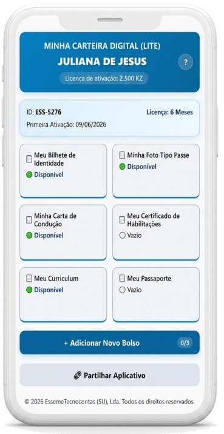
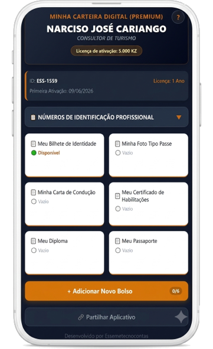
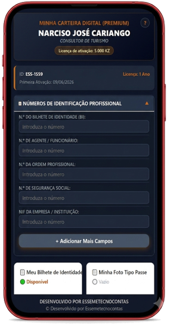

# 📱 PORTAL DE CARTEIRA DIGITAL - Landing Page Official

Esta é a página web oficial de apresentação, conversão e download para o aplicativo **Minha Carteira Digital**, desenvolvido pela **EssemeTecnocontas (SU), Lda.**. O portal foi projetado para guiar o utilizador angolano de forma simples e intuitiva na aquisição e instalação do ecossistema nas versões **LITE** e **PREMIUM**.

---

## 🎯 Fluxo Estratégico de Configuração (Antissusto)

Para garantir a melhor experiência e evitar que o cliente se assuste com os alertas de segurança do ecossistema Android, a página estabelece uma ordem cronológica e didática de configuração:

1. **Descarregar o Aplicativo:** Escolha da versão e download direto do instalador oficial (`.apk`).
2. **Instalação e Permissões:** Ativação da permissão para "Fontes Desconhecidas" no navegador.
3. **Ignorar Alerta do Android:** Nota explicativa detalhando que, por ser um software inovador, independente e 100% offline (privacidade total sem dados na nuvem), o sistema exibirá um aviso padrão. O utilizador é instruído a clicar em *"Instalar mesmo assim"*.
4. **Ativação da Licença:** Cópia do ID de hardware gerado no aparelho e envio ao suporte para validação da licença.
5. **Carregar os Ficheiros:** Inclusão dos documentos (Fotos ou PDFs) diretamente nos bolsos da aplicação.

---

## 💎 Modelos de Negócio e Versões

### 🔹 Versão LITE
* **Modelo:** Plano Semestral (2.500 KZ Acesso Inicial / 1.200 KZ Renovação).
* **Interface:** Visual corporativo em tons de Azul.
* **Capacidade:** 6 Bolsos Fixos Padrão + até 3 Bolsos Customizados Extra.

### 👑 Versão PREMIUM
* **Modelo:** Plano Anual (5.000 KZ Acesso Inicial / 2.500 KZ Renovação).
* **Interface:** Visual de Luxo em Modo Escuro com detalhes em Dourado.
* **Capacidade:** 6 Bolsos Fixos Padrão + até 6 Bolsos Customizados Extra.
* **Diferencial:** Aba expansível de **Números de Identificação Profissional** (Efeito "Crachá Digital" com Nome, Cargo e Número Profissional).

---

## 📸 Demonstração das Interfaces (Preview)

| Versão LITE (Azul) | Versão PREMIUM (Escuro/Ouro) | PREMIUM (Campos Abertos) |
| :---: | :---: | :---: |
|  |  |  |

---

## 🛠️ Tecnologias
* HTML5 (Estrutura Semântica)
* CSS3 Avançado (Layout Responsivo com Flexbox e CSS Grid)

## 📂 Estrutura Arquivos Gráficos no Repositório
Para o correto funcionamento do portal, certifique-se de que os seguintes arquivos de imagem estão na raiz do projeto com os nomes exatos:
* `iconlite.png` - Ícone da versão LITE
* `iconpremium.png` - Ícone da versão PREMIUM
* `imagemlitefrontal.png` - Captura do ecrã da versão LITE
* `img fontal premiu.png` - Captura do ecrã da versão PREMIUM frontal
* `premiu,com aba numeros aberto.png` - Captura da aba de identificação aberta

---
© 2026 EssemeTecnocontas (SU), Lda. Todos os direitos reservados.
